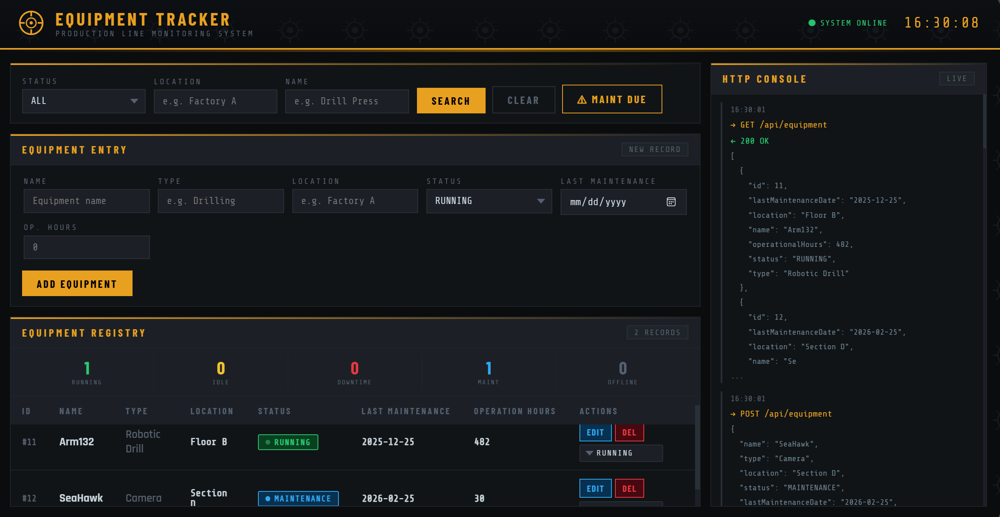

# Full-Stack Software Engineer Showcase — Spring Boot REST API

## Overview
This project was built to **demonstrate my backend engineering strengths using Spring Boot**, with a primary focus on **REST API design, ORM usage, and scalable service architecture**.

While a frontend interface is included to improve usability and interaction, the **core emphasis of this application is backend system design and database interaction** using PostgreSQL.

The application enables users to interact with persistent data through a clean RESTful API powered by Spring Data JPA.

---

## Application Preview

---

## Live Deployment
👉 **[Live Application:](https://production-line-equipment-tracker-production.up.railway.app/)** 

---

## Tech Stack

### Backend (Primary Focus)
- Java
- Spring Boot
- Spring Data JPA
- Hibernate ORM
- REST API Architecture
- PostgreSQL

### Frontend
- Vanilla JavaScript
- Styled with AI-assisted prompt engineering

### DevOps & Deployment
- Docker (Containerized Application)
- Railway (Cloud Deployment)

---

## Architecture Overview

The system follows a **loosely coupled layered architecture** designed for maintainability and scalability.

### Components
- **Entity Layer**
  - Database mapping using JPA entities.

- **Repository Layer**
  - `JpaRepository` abstraction for database operations.

- **Service Layer**
  - Implemented as an **IoC-managed Spring Bean**.
  - Handles business logic and orchestration.

- **DTO Layer**
  - Separates internal domain models from API contracts.
  - Improves maintainability and prevents entity exposure.

- **Controller Layer**
  - REST endpoints exposing application functionality.

---

## Backend Flow
  Client -> Controller -> DTO Mapping -> Service (IOC Bean) -> JPA Repository -> PostgreSQL Database

---

## AI-Assisted Frontend Development

To prioritize deeper learning and implementation of backend concepts, **AI prompt engineering was intentionally used to assist with frontend styling and UI refinement**.

This allowed development time to remain focused on:

- REST API design
- ORM behavior and persistence management
- DTO separation patterns
- Spring dependency injection and inversion of control

The frontend exists primarily as a user interface for interacting with backend functionality.

---

## Containerization

The application is fully containerized using Docker, allowing:

- Consistent environments across development and deployment.
- Simplified cloud hosting through Railway.

---

##  Features

- RESTful API endpoints
- PostgreSQL persistence
- DTO abstraction layer
- Dependency Injection (IoC)
- ORM using Hibernate/JPA
- Dockerized deployment
- Cloud hosted backend

---

##  Future Improvements

- Authentication & Authorization (JWT)
- API Documentation 
- Expanded validation layer
- CI/CD automation

---

## Author

A full stack application built as a backend-focused learning and showcase project demonstrating:

- Spring Boot Architecture
- REST API Engineering
- ORM & Database Design
- Containerized Deployment

---

## 📄 License

Specify license here (MIT / Apache 2.0 / etc.)
